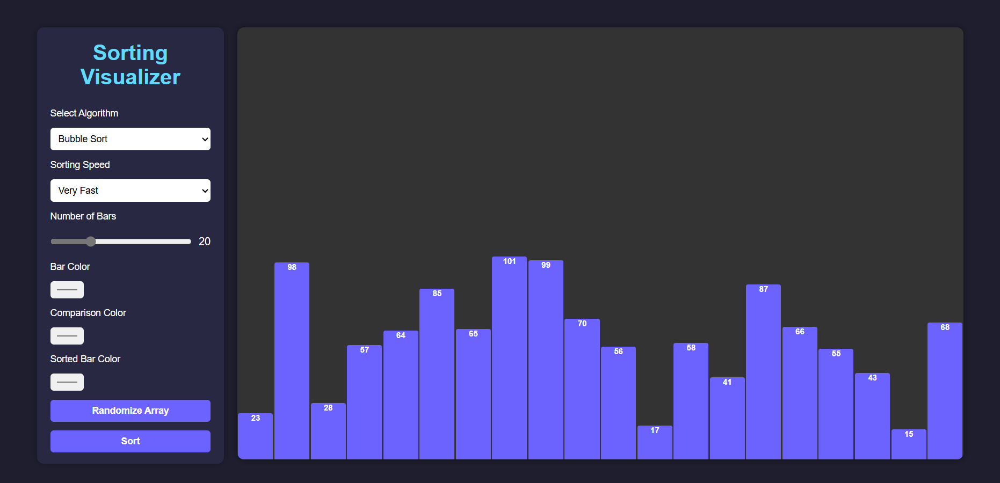
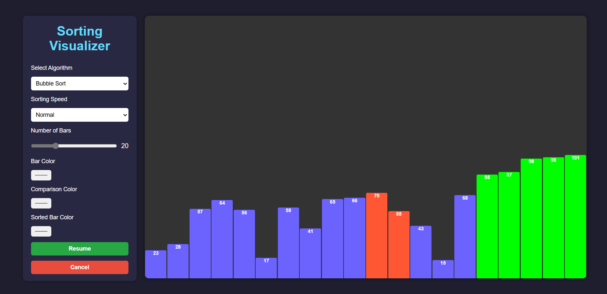
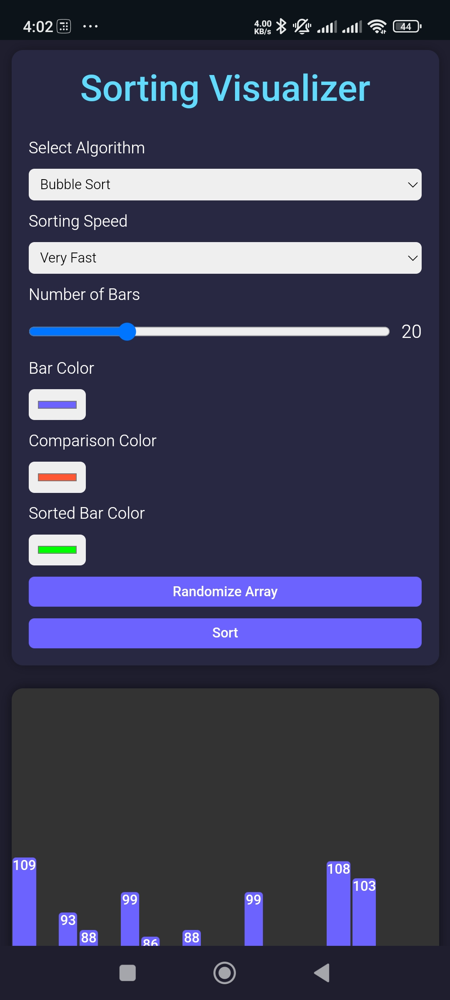
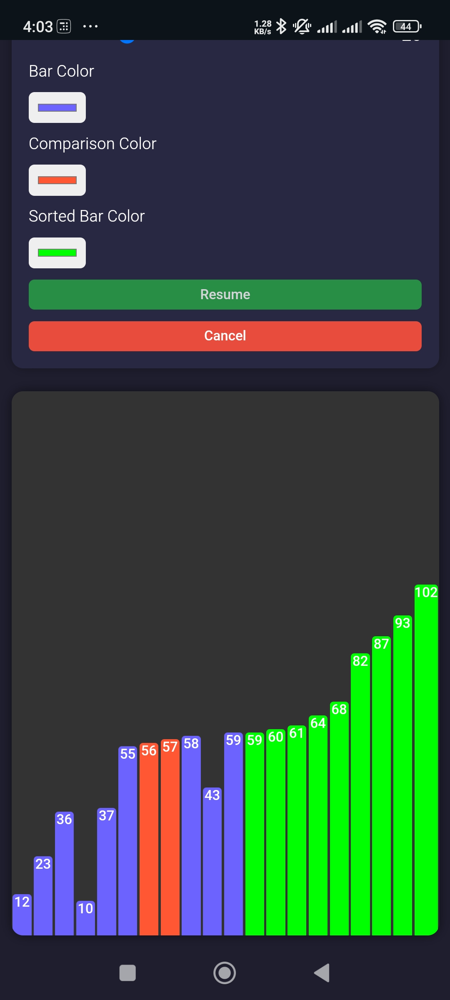

# Sorting Visualization App

This Sorting Algorithm Visualizer is an interactive web application designed to simplify the understanding of sorting algorithms. It provides dynamic visual feedback, showcasing how elements are compared, swapped, and ultimately sorted. Users can choose from various popular sorting algorithms, including Bubble Sort, Selection Sort, Insertion Sort, Quick Sort, and Merge Sort, to see how each works in real-time.

The app allows for customization, such as adjusting the array size, changing the sorting speed, and selecting custom colors for bars, comparisons, and sorted elements. It also includes intuitive controls for generating random arrays, starting the sort, and pausing, resuming, or canceling the process at any time.

Built with HTML, CSS, and JavaScript, the application is responsive and works seamlessly on different devices. It's perfect for students, developers, and anyone curious about sorting algorithms. Future updates will include additional algorithms, step-by-step explanations, and features like dark mode.

Clone the repository, explore the visualizer, and experience sorting like never before! Contributions are always welcome. 🚀

## UI Screenshots

### Screenshot 1

### Screenshot 2

### Screenshot 1

### Screenshot 2

